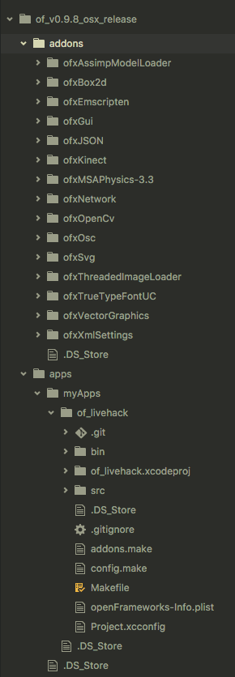

# ポップコーンミュージック ~ 動きは恥だが歌詞が出る ~

## 概要
- LiveMusicHackaSONG 2017 チーム「紀尾井坂46」のプロダクト
- 指定した音楽に合わせて同期歌詞が表示される
- 歌詞が終わると画面上に文字が落ちる
- webカメラで人物を撮影し、動作を取得している
- 動きに応じて、落ちた文字を動かせる
- 動かした文字が画面上部に当たると、文字がポップコーンに変わっていく

## インストール手順
1. [こちら](http://openframeworks.cc/setup/xcode/)を参考にopenframeworksをディレクトリにダウンロードする
1. `${openframeworksのディレクトリ}/apps/myApps`の中にこのリポジトリをクローンする
1. 必要なaddonを`${openframeworksのディレクトリ}/addons/`にダウンロードしておく
1. `${openframeworksのディレクトリ}/apps/myApps/of_livehack/bin/data`に必要な楽曲、歌詞、フォント、画像データを入れる
1. `${openframeworksのディレクトリ}/projectGenerator-osx/projectGenerator.app`をFinderから起動
1. `Import`を押して`${openframeworksのディレクトリ}/apps/myApps/of_livehack`を選択して`開く`を押す
1. addonの追加が必要な場合は必要なaddonを追加して、`Update`を押す
1. ビルド完了の画面が出るまで待ち、完了したら
1. `${openframeworksのディレクトリ}/apps/myApps/of_livehack/of_livehack.xcodeproj`をクリックし、xcodeを起動
1. 上部左のschemaを`of_livehack > My Mac (64-bit)`に変更
1. 上部左のRunボタンから実行

### ディレクトリ構成

